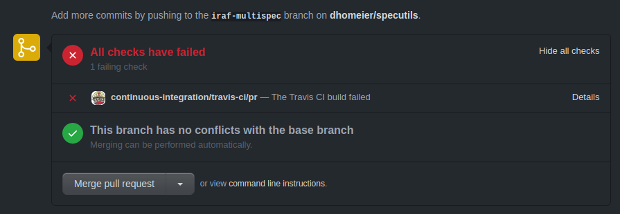

---
jupyter:
  jupytext:
    text_representation:
      extension: .md
      format_name: markdown
      format_version: '1.2'
      jupytext_version: 1.6.0
  kernelspec:
    display_name: Python 3
    language: python
    name: python3
---

<!-- #region slideshow={"slide_type": "slide"} -->
# Open Development

Author: *Erik Tollerud* (@eteq on Github)

 

<!-- #endregion -->

<!-- #region slideshow={"slide_type": "fragment"} -->
Co-authors from previous versions of the materials: *Brigitta Sipőcz* (@bsipocz), *Thomas Robitaille* (@astrofrog)
<!-- #endregion -->

<!-- #region slideshow={"slide_type": "slide"} -->
# What is Open Development?

* An approach to software development where all steps in the process (or at least as many as possible) are done in public.
<!-- #endregion -->

<!-- #region slideshow={"slide_type": "fragment"} -->
* This is more than "just" open source: it means all software contributions are done in the open, with review and discussion on them available to all who wish to participate.
<!-- #endregion -->

<!-- #region slideshow={"slide_type": "fragment"} -->
* The level at which any given person has influence depends on how a project is governed.  But many tend to operate as "do-ocracy" - the more work you're willing to do, the more influence you have.
<!-- #endregion -->

<!-- #region slideshow={"slide_type": "slide"} -->
# What are Key Social Elements of Open Development?
<!-- #endregion -->

<!-- #region slideshow={"slide_type": "fragment"} -->
* A shared space to publicize and propose changes to code. While lots of platforms exist to do this, [Github](https://github.com/) and [Gitlab](https://gitlab.com/) are the most well-known these days. Usually there's a canonical "main" version of the project, and a modern distributed version control system like `git`, although this isn't strictly necessary.

  Note this is *not* the same as an open source code repository, which may or may not enable open *development*.
  
  Even just a mailing list with patches can suffice (and indeed some open development models like [Linux swear by it to this day](https://lwn.net/Articles/702177/)).
<!-- #endregion -->

<!-- #region slideshow={"slide_type": "fragment"} -->
* A space to *discuss* those proposed changes that is public. Often this is the code submission itself, but might also be an independent mailing list, or both,
<!-- #endregion -->

<!-- #region slideshow={"slide_type": "subslide"} -->
## What's not definitional but *practically* needed?

<!-- #endregion -->

<!-- #region slideshow={"slide_type": "fragment"} -->
* Rules of engagement and related social norms.  Sometimes this is entirely unspoken, but in current times it's becoming more common to have at least partly an explicit code of conduct (for an example, see [Astropy's](https://www.astropy.org/code_of_conduct.html)). But without this no one knows how to behave and contributions quickly evaporate.
<!-- #endregion -->

<!-- #region slideshow={"slide_type": "fragment"} -->
* Someone who will make a decision on what code is acceptable and what needs changes (typically in the form of code review).  Often a maintainer of some portion of the code, either explicity or through experience and trust.
<!-- #endregion -->

<!-- #region slideshow={"slide_type": "fragment"} -->
* A space or spaces to discuss things like long-term planning or elements of the project not directly tied to the code like reaching out to users who are not controbutors, funding proposals, governance policies, decisions about release timing, and so on.
<!-- #endregion -->

<!-- #region slideshow={"slide_type": "subslide"} -->
## And what's less obvious?
<!-- #endregion -->

<!-- #region slideshow={"slide_type": "fragment"} -->
* A place to build a shared culture and sense of humanity in the team. Sometimes this means face-to-face, but can also be an IRC/Slack/Matrix channel with silly jokes.
<!-- #endregion -->

<!-- #region slideshow={"slide_type": "fragment"} -->
* Mechanisms for credit.  Without these Open Development can turn into a seemingly faceless mass of code with no one willing to "own" it.  Plus, it's important for people's livelihood to point to what they've helpded build!
<!-- #endregion -->

<!-- #region slideshow={"slide_type": "fragment"} -->
* Software diplomats - people willing to do the work of building consensus in a public space on highly technical areas when the stakes are frequently *very* low (and emotions therefore very high...)
<!-- #endregion -->

<!-- #region slideshow={"slide_type": "fragment"} -->
* Many other tasks large and small! For a quick look at the breadth of roles, check out [Allcontributrs](https://allcontributors.org/) or a team role page like [Astropy's](https://www.astropy.org/team.html).
<!-- #endregion -->

<!-- #region slideshow={"slide_type": "slide"} -->
# What are the Core Technical Enablers of Open Development?

None of these are definitional, but in practice they are critical for modern projects:

* Distribution and packaging mechanisms
* Automated (or automatable) testing
* Documentation (often partially automated)
<!-- #endregion -->

<!-- #region slideshow={"slide_type": "subslide"} -->
## Distribution and packaging mechanisms

By this I mean a way to declare a canonical version of the source code and wrap it up in a way that lets users reproduce locally what the developers have implemented.  In different languages that's takes different forms, including:

* Python packages from PyPI
* Rust crates from crates.io
* Javascript/Node packages and modules on NPM
* OS-specific package managers like APT, macports, etc
* A tarball with a makefile tagged with a specific version number

All of these are distribution mechanisms that let there be a version that is released for users to easily access.  That way there's a shared understanding of what any given software change is coming from and where it will eventually appear for general consumption when accepted.
<!-- #endregion -->

<!-- #region slideshow={"slide_type": "subslide"} -->
## Automated (or automatable) testing

While in principle an Open Development project does not need tests, in practice all but the simplest software will quickly become a bug-ridden mess without some way to ensure that new changes don't break old use cases. The Law of Unintended Consequences is iron-clad. So *some* form of testing that can be run repeatedly is usually necessary.  This can be any level of manual, but anything manual is often ignored...
<!-- #endregion -->

<!-- #region slideshow={"slide_type": "fragment"} -->
So the modern solution for this is automated testing that runs with every suggested code change - this is the core principle of "Continuous Integration" (CI). Modern CI frameworks can be arbitrarily complicated but generally run a testing framework that is specific to the language of the software being written, and displays the outcome in summary form when the code is submitted. For a canonical example, see how Travis CI renders in Github on a Python Project:

<!-- #endregion -->

<!-- #region slideshow={"slide_type": "subslide"} -->
## Documentation (often partially automated)

While again not strictly necessary, in practice most users or novice contributors have neither the time nor the background to delve into the code, issue tracker, or mailing list to understand the exact application for most parts of a code base.  So both user and developer-oriented documentation are usually necessary to enable Open Development.

As with testing, keeping this documentation p-to-date as part of code contributions is part of the magic of Open Development - without it a project tends to stay known only to a small core who understand the big picture. It also tends to require CI-like system for documentation - a prominent example is [Readthedocs](https://readthedocs.org/).

In practice this documentation usually lives as a part of the source code, versioned along with it. Some languages (particularly more modern ones) even have toolchains to closely connect code and documentation.  For example,  Python, Julia, and Rust all have a native or highly popular documentation tool that produces docs from appropriately-tagged source code.
<!-- #endregion -->

<!-- #region slideshow={"slide_type": "slide"} -->
# Exercises/Tutorial Overview

While the above is a conceptual overview of the critical elements of Open Development, such a broad concept is hard to grasp without diving into some practical experiences. The rest of this tutorial is centered around exactly this - exploring the pieces of Open Development mentioned above via worked examples.

Note that some parts of these tutorials suggest you try them with a partner.  While you can't "turn to your neighbor" if you are doing this tutorial on your own at a virtual conference, I strongly encourage you to find someone to try the tutorial with.  As the above describes, Open Development is as much a social as it is a technical process, so having at least one other person is necessary to really grok what's going on.

While the rest of this session focuses on Python and Github as practical implementations of all of these principles, it's critical to realize that's just one set of platforms. Indeed you may find that half way through you're better off trying to map these concepts onto a language or platform you are more comfortable with. Go for it!  I'd love to hear how it works!  But hopefully you'll find all these same elements and learn how they make Open Development possible.

On to [Part 2](Part2_prs_and_reviewing.ipynb)!
<!-- #endregion -->
